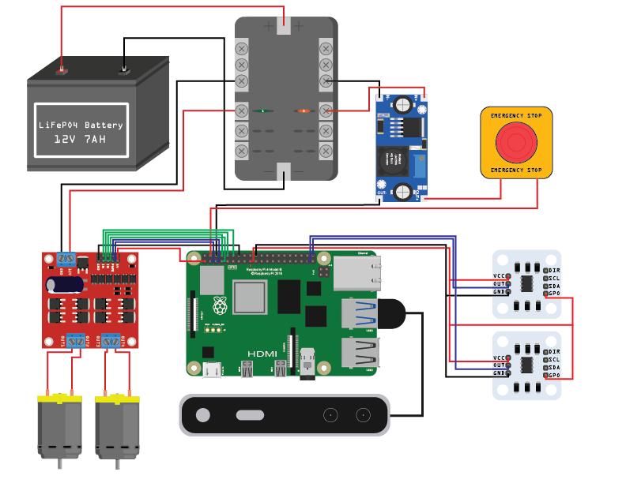

#### Design Ideology

The electrical system was designed with repeatability and scalability as its primary goals. This approach allowed for both our chair and our trash can robots to share, fundamentally, the same electronics, despite differences in mechanical structure and motor power requirements

#### The Electronics: High Level Overview

From a high level, our electrical systems can be understood through the energy/data flow diagram shown below:

Both robots are fully powered off of a single standalone battery, with the trash can having a 12V 7Ah LiFePO4, and the chair having a 12V 5Ah sealed lead-acid battery.

Power from the battery is routed through a fuse box, which provides both overcurrent protection and a convenient distribution point for multiple components. From the fuse box, the 12 V rail directly supplies power to the motor controllers, while a DC–DC buck converter steps the voltage down from 12 V to 5 V to power the Raspberry Pi.

Then, the Raspberry Pi supplies 3.3V logic power to the magnetic encoders and the logic-side power inputs of the motor controllers via its GPIO headers. The Intel RealSense camera is powered directly from one of the Raspberry Pi’s USB ports, which also carries data.

In terms of data flow, the Raspberry Pi communicates wirelessly with an external laptop, which is responsible for high-level robot motion commands. The Raspberry Pi sends its pose data from AprilTags or person-recognition through mediapipe as well as the encoder feedback from the motors. Based on these inputs, it generates motor control signals that are sent to the motor controllers via GPIO pins. Speed is controlled using PWM signals, while motor direction is set using a digital HIGH/LOW control line.

#### Electronics: Lower-Level Description

Our electronics can be further inspected through our electrical diagram shown below:

Power and ground from the battery are connected directly to the main input terminals on the fuse box. Individual fused outputs from the fuse box supply the motor controller and the DC–DC buck converter with power. It should be noted that our motor controller is connected with a 1A fuse on our trash can and a 35A fuse on our chair, due to the high power consumption of the differing motors. The buck converter, however, is protected by a 5A fuse in both systems.

Fuse values were selected based on motor datasheet specifications, with additional margin to accommodate the surge current that occurs during motor startup. The 5A fuse for the buck converter was determined by dividing the recommended power supply for the Raspberry Pi, 25W, by our 12V input voltage, to get a value of about 2A. However, the closest fuse value we had on hand was 5A, which we deemed acceptable as we had powered the Raspberry Pi off of a 65W external power supply.

The output of the buck converter is then routed through an emergency stop (e-stop) switch to provide an additional layer of safety, and then into the Raspberry Pi’s 5V power input. From the Raspberry Pi, the motor controllers and the magnetic encoders are powered through the 3.3V pins, and the Raspberry Pi’s GPIO connections provide and receive control signals to the motor controllers and from the magnetic encoders. In the wiring diagram, green wires represent digital HIGH/LOW signals used to control motor direction, while blue wires represent PWM signals used for speed control and encoder output.

The motors are connected directly to the motor controller outputs, with motor direction being reversed electrically by swapping motor polarity as commanded by the controller. Finally, the camera is connected to the Raspberry Pi via USB, which supplies both power and data connectivity.
